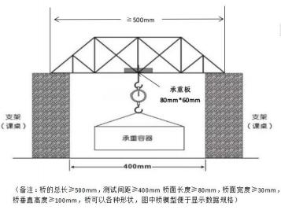
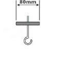

# 平阳县昆阳三中学校文件

**政教字〔2026〕35号**

---

## 关于印发昆阳三中第28届科技节活动方案的通知

---

### 一、科学视界秀场

#### 初中学生“创想Idea”解说

**参加对象**：全校在籍在读学生。

##### （一）比赛要求

1. **创意**：学生观察周边生活环境或事物，有创意地提出某一项奇思妙想。创意要改进研究对象原有的缺点不足，提升其实用性、便捷性等，蕴含“面向未来”的创意元素。
2. **实现**：根据自己的创意点子，通过建构模型、绘制图纸、编写程序、组搭硬件器材或制作多媒体作品等形式展现创意的具体想法或制作出实物作品。
3. **展示和互动**：由1—2名合作人员登台分工合作阐述创意或演示作品，借助PPT等载体辅助解说，解答现场评委提问。解说时间4分钟以内，评委互动时间2分钟以内（评委现场提问1—2个问题）。

##### （二）报名时间

各班级要认真组织好选拔工作，每班限2支队伍参加，于9月28日（周一）前将报名表上交少年宫办公室。

##### （三）比赛时间和地点

比赛定于10月8日周四下午（暂定）。

---

### 二、普及实践板块

#### 1. 自制潜水器

**参加对象**：全校在籍在读学生。

##### （一）比赛要求

要求如下：两个小时内完成制作调试。

1. 生活舱和水舱独立分开，上方有密封舱门；生活舱要大于水舱，只能放配重物，不能进水。符合要求设计为15分，整体美观程度为0—5分（共20分）。
2. 潜浮打捞测试环节，制作调试好的潜水器漂浮在水面利用注射器来控制潜水器。完成以下3项任务：
   - **任务1**：完成从水面潜到水下20厘米深度位置停留5秒（20分）；
   - **任务2**：完成从水底上浮到距水底25厘米的位置停留5秒（20分）；
   - **任务3**：完成从水底打捞搬运两个重物到指定的位置（20分）。

3分钟之内完成3项任务计60分。最后按成绩排名，合计3个任务完成的时间，用时越少，分数越高。

**可使用的材料**：带瓶盖的矿泉水瓶（380ml）4个、200ml注射器和配套的1米长塑料软管、150克密封胶泥、500克配重物、透明胶、剪刀、美工刀、刻度尺、热熔胶枪和胶棒（2根）、记号笔、20厘米长直径1毫米的铁丝等。

##### （二）报名时间

各班级要认真组织好选拔工作，每班限2支队伍参加，于9月28日（周一）前将报名表上交少年宫办公室。

##### （三）比赛时间和地点

比赛定于10月8日周四下午（暂定）。

请在比赛时间前完成作品制作，并携带作品来进行比赛。

---

#### 2. 木制桥梁承重

**参加对象**：全校在籍在读学生。

##### （一）比赛要求

**可用木制桥梁材料**：12根 `2.5mm × 2.5mm × 550mm` 的松木条，101胶水一瓶通用版20克；辅助工具：直尺、剪刀、美工刀、铅笔、砂纸、白纸，辅助工具不能作为桥体材料。

**比赛规则**：在2小时内，利用主办方提供的材料和工具，现场完成木制桥梁模型的制作，不得带入其他的材料和工具，经审核后，符合竞赛技术要求的模型，参与承重测试。桥的总长 ≥ 500mm，测试间距 ≥ 400mm，桥面长度 ≥ 80mm，桥面宽度 ≥ 30mm，垂直高度 ≥ 100mm，总重量 ≤ 23克，模型设计须能顺畅放置承重板（如图1），承重板外形尺寸为 `80mm × 60mm`（如图2）。在承重过程中，模型与支架之间不得加垫任何辅助物，承重前，模型的最低点不得低于支架的上水平面。

在承重测量前，由裁判员对参赛模型进行称重、测量、登记。利用悬挂承重测试器材对桥梁模型承重测试，静止悬挂承重10秒以上承重测试有效，每一队有两次测试机会，以最大有效承重值为该模型的最终承重成绩。承重重量以克为单位，承重重量高者为优，名次列前，承重重量相同，则模型重量轻者名次列前。

**图1**：

**图2**：

##### （二）报名时间

各班级要认真组织好选拔工作，每班限2支队伍参加，于9月28日（周一）前将报名表上交少年宫办公室。

##### （三）比赛时间和地点

比赛定于10月8日周四下午（暂定）。

请在比赛时间前完成作品制作，并携带作品来进行比赛。

---

#### 3. 小课题DV

**参加对象**：全校在籍在读学生。

##### （一）比赛要求

1. **选题要求**：小课题应具有一定的价值与意义，同时研究又能切合初中学生的学习生活实际。选题可以从以下3个方面着手：
   - ① **创新实验类**：实验的改进；探究实验的开发等。
   - ② **实践探索类**：低碳理念的实践应用；调查（本区域污染的调查，动、植物资源的调查，营养与健康的调查，疾病与防治的调查等）；星空的观测；资源的开发与利用等。
   - ③ **文献研究类**：科学史的研究；科学成果的比较研究等。
2. **制作要求**：小课题DV内容应包括所在学校、研究成员及指导师介绍、研究课题名称、研究缘起、研究的主要方法、研究的主要过程及研究的主要成果等，拍摄总时间5—8分钟，格式为mp4，不超过200M。

##### （二）报名时间

各班级要认真组织好选拔工作，每班限2支队伍参加，于9月28日（周一）前将报名表上交少年宫办公室。

##### （三）比赛时间和地点

作品定于10月8日周四上交至莹莹老师处。

---

### 三、报名汇总表

**中小学科创运动会初中学生参赛项目报名汇总表**

（初中学生“创想Idea”解说、自制潜水器、木制桥梁承重、小课题DV项目）

> [!NOTE]
> 我认为你们已经完成了这些报表

报名表于9月28日（周一）前将报名表上交少年宫办公室。