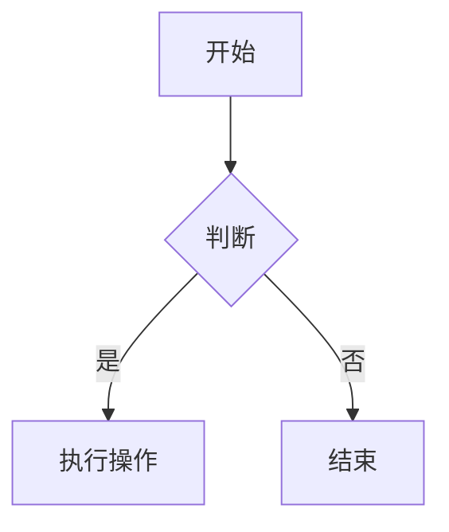
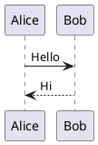

# 全功能 Markdown 测试文档

> 本文档用于测试 Markdown 解析器对 CommonMark、GFM 及常见社区扩展的支持。
> 部分语法为扩展功能，实际渲染效果取决于解析器与插件。

## 目录

[[toc]]

## 1. 核心语法 (CommonMark)

### 1.1 标题

# H1 标题
## H2 标题
### H3 标题
#### H4 标题
##### H5 标题
###### H6 标题

Setext 风格：

一级标题
===

二级标题
---

### 1.2 段落与换行

这是一个普通段落。

这是另一个段落，中间有空行。

这是同一段落内的换行，  
行尾有两个空格实现硬换行。

这是使用反斜杠的硬换行\
下一行。

### 1.3 强调

*斜体* 或 _斜体_

**粗体** 或 __粗体__

***粗斜体*** 或 ___粗斜体___

### 1.4 列表

无序列表：

- 项目 A
- 项目 B
  - 嵌套项目 B1
  - 嵌套项目 B2
- 项目 C

有序列表：

1. 第一项
2. 第二项
   1. 嵌套有序 2.1
   2. 嵌套有序 2.2
3. 第三项

混合列表：

- 项目
  1. 有序子项
  2. 有序子项
- 项目

### 1.5 代码

行内代码：`const a = 1;`

围栏代码块：

```javascript
function hello() {
  console.log('Hello, Markdown!')
}
```

缩进代码块：

    indented code block
    line 2

### 1.6 链接与图片

[普通链接](https://example.com)

[带标题的链接](https://example.com "示例网站")

<https://example.com>


[](https://example.com)

### 1.7 引用

> 这是一级引用。
>
> > 这是嵌套引用。
>
> 回到一级引用。

### 1.8 分隔线

---

***

___

## 2. GFM 扩展

### 2.1 表格

| 左对齐 | 居中对齐 | 右对齐 |
| :--- | :---: | ---: |
| 单元格 | 单元格 | 单元格 |
| 内容 | 内容 | 内容 |

### 2.2 任务列表

- [x] 已完成任务
- [ ] 未完成任务
- [ ] 待办事项

### 2.3 删除线

~~删除线文本~~

### 2.4 自动链接

https://example.com

www.example.com

user@example.com

### 2.5 脚注

这是一个脚注引用[^1]，还有另一个[^note]。

[^1]: 这是脚注内容。
[^note]: 这是命名脚注。

### 2.6 告示（GitHub Alerts）

**不写名字**：只有内容 + 左侧色条，不再强制塞「注意」这种默认标题：

> [!NOTE]
> 这是没写名字的告示。类型靠左侧色条和 aria-label 表达，读屏能识别。

五种类型（都不写名字）：

> [!NOTE]
> 提示信息。

> [!TIP]
> 技巧信息。

> [!IMPORTANT]
> 重要信息。

> [!WARNING]
> 警告信息。

> [!CAUTION]
> 注意事项。

**写了名字就用你写的**（这才是重点，不会被默认标题盖掉）：

> [!NOTE] 部署前须知
> 名字完全按你写的来。

> [!WARNING] 改这个文件前先备份
> 中文名字、长句子都行。

> [!TIP] 小技巧：用 `rg` 比 `grep` 快
> 名字里允许行内代码。

### 2.7 提示框（容器语法）

用 `:::` 写，也可以自定义名字：

::: note
默认名字的提示框。
:::

::: warning 自定义标题的警告框
名字写在类型后面就是标题。
:::

::: tip 用 `npm run build` 构建
标题里也能放**加粗**、行内代码这些行内语法。
:::

::: tip
提示框。
:::

::: details
详情容器，默认标题是「详情」。
:::

::: danger 危险操作
删除前请三思。
:::

::: success 完成
这一步做完了。
:::

::: question 疑问
这里没想明白。
:::

::: info 信息
补充说明。
:::

## 3. 内容增强

### 3.1 Emoji

:smile: :heart: :+1: :rocket:

### 3.2 上下标

H~2~O

x^2^ + y^2^ = z^2^

### 3.3 高亮/标记

==高亮文本==

### 3.4 缩写词

*[HTML]: 超文本标记语言
*[CSS]: 层叠样式表

HTML 和 CSS 是网页基础。

### 3.5 定义列表

术语 1
: 定义 1

术语 2
: 定义 2
: 另一个定义

### 3.6 插入与删除

<ins>插入文本</ins>

<del>删除文本</del>

### 3.7 Ruby 注音

{漢字|かんじ}

### 3.8 剧透

>! 这是剧透内容，点击显示。

### 3.9 图标（行内 SVG）

站点图标一律用内联 SVG，不用 emoji / 图标字体（emoji 在部分系统上会画出彩色方块）：

<svg viewBox="0 0 16 16" width="16" height="16" fill="currentColor" aria-hidden="true"><path d="M8 1.2 15 14H1L8 1.2Zm0 3.2a.9.9 0 0 0-.9.9v2.8a.9.9 0 0 0 1.8 0V5.5A.9.9 0 0 0 8 4.6Zm0 5.6a1 1 0 1 0 0 2 1 1 0 0 0 0-2Z"/></svg> 行内 SVG 会跟随文字颜色，也能正常缩放。

## 4. 学术与技术

### 4.1 数学公式 (KaTeX)

行内公式：$E = mc^2$

块级公式：

$$
\int_{-\infty}^{\infty} e^{-x^2} dx = \sqrt{\pi}
$$

### 4.2 MathJax

行内：\(a^2 + b^2 = c^2\)

块级：

\[
\frac{\partial}{\partial t} \Psi = i\hbar \frac{\partial}{\partial t} \Psi
\]

### 4.3 代码高亮

```python
def greet(name):
    return f"Hello, {name}!"
```

### 4.4 高亮指定行

在语言后面写 `{1,3-5}`，被点名的行会加上高亮底色（**不显示行号**）：

```javascript {1,3-5}
// 第 1 行高亮
const a = 1
const b = 2
// 第 4 行
// 第 5 行
const c = 3
```

### 4.5 显示行号

在语言后面写 `:line-numbers`，左侧会出现行号栏：

```javascript:line-numbers
const a = 1
const b = 2
const c = 3
```

两者可以叠加，用空格分隔：

```javascript:line-numbers {2}
const a = 1
const b = 2
const c = 3
```


## 5. 图表与可视化（未启用）

本站**没有**接 Mermaid / PlantUML / ECharts / Flowchart 的渲染器，
下面几段会按普通代码块原样显示。保留它们是为了确认降级后不会报错、不会吃掉内容。

### 5.1 Mermaid



### 5.2 PlantUML



### 5.3 ECharts

```echarts
{
  "title": { "text": "示例图表" },
  "xAxis": { "type": "category", "data": ["A", "B", "C"] },
  "yAxis": { "type": "value" },
  "series": [{ "data": [10, 20, 30], "type": "bar" }]
}
```

### 5.4 Flowchart

```flow
st=>start: 开始
op=>operation: 操作
cond=>condition: 判断?
e=>end: 结束

st->op->cond
cond(yes)->e
cond(no)->op
```

## 6. 文档导航与结构

### 6.1 标题锚点

## 带自定义 ID 的标题 {#custom-heading}

[跳转到自定义标题](#custom-heading)

### 6.2 目录

[[toc]]

### 6.3 属性

# 标题 {#id .class style="color: red"}

段落文本 {.highlight}

### 6.4 自定义容器

就是 §2.7 那套 `:::`，八个类型任选；再写一遍是为了放在导航章节里对照。

::: warning
这是一个警告容器。
:::

::: tip
这是一个提示容器。
:::

### 6.5 选项卡 tabs

由 `@mdit/plugin-tab` 提供。容器写 `::: tabs`，每个页签用 `@tab 标题` 起头：

::: tabs

@tab 标签 1
第一个页签的内容。

@tab 标签 2
第二个页签的内容。

:::

**默认选中第一个**。想默认展开别的页签，把那个写成 `@tab:active`：

::: tabs

@tab 第一个
默认不选它。

@tab:active 第二个
这个才是默认展开的。

:::

标题支持行内 Markdown，代码块、公式、列表也都能放进页签里：

::: tabs

@tab 用 `npm` 安装
```bash
npm i @mdit/plugin-tab
```

@tab 手动下载
直接引 `dist/cdn.umd.js`，它自带依赖，不依赖 CDN。

:::

给页签和容器起 `#id` 可以做**跨容器联动**（点一个，同 id 的另一个跟着切）：

::: tabs #demo-group

@tab 甲 #tab-a
联动组里的 A。

@tab 乙 #tab-b
联动组里的 B。

:::

::: tabs #demo-group

@tab 甲 #tab-a
这是第二个容器，跟着一起切。

@tab 乙 #tab-b
同上。

:::

只有一个页签时，标签行会自动隐藏（写了也没意义）：

::: tabs

@tab 唯一
孤零零一个页签。

:::

两个注意点：

- **外层围栏要加长才能嵌套。** `::: tabs` 放进 `::: warning` 里的话，
  外层第一个 `:::` 会被当成它的结束符，把标签页截断。把外层写成四个冒号
  （`:::: warning` … `::::`）就没问题 —— `:::` 比它短，不会被误认成结束符。
- 写了 `::: tabs` 却一个 `@tab` 都没有时，整块会被丢掉（什么都不输出），
  而不是留下一个空的边框盒子。

### 6.6 布局（未启用）

`::: layout` / `::: col` **没有实现**，会原样显示：

::: layout
::: col
左列内容
:::
::: col
右列内容
:::
:::

## 7. 其他实用功能

### 7.1 图片尺寸


### 7.2 图片懒加载


### 7.3 图片预览

[](https://via.placeholder.com/800)

### 7.4 主题标记


### 7.5 包含文件（未启用）

`@include` **没有实现**，会原样显示：

@include "other.md"

### 7.6 导入代码片段（未启用）

`@snippet` **没有实现**，会原样显示：

@snippet "file.js"#section

### 7.7 自定义嵌入（未启用）

`@embed` **没有实现**，会原样显示：

@embed "component"

### 7.8 内容对齐（未启用）

`->…<-` 这套箭头语法 **没有实现**，会原样显示：

->居中内容<-

->右对齐内容->

<-左对齐内容<-

### 7.9 行内剧透

用 `!!` 包起来，默认被遮住，点一下才显示：

这句话里藏了一个 !!隐藏答案!! ，点开才看得到。

注意：`!!` 里面不能出现 `!`，也不能跨行。

## 8. 站点扩展语法

### 8.1 卡片 card

单张卡片，只有标题：

<card link="idea/1.归途且慢.md">归途，且慢</card>

带日期的卡片：

<card link="idea/1.归途且慢.md" date="2026.9.27">归途，且慢</card>

一行里放两张，彼此独立：<card link="a.md">甲</card><card link="b.md" date="9.27">乙</card>

外链卡片原样跳转：<card link="https://example.com/?a=1&b=2">外链卡片</card>

没写 link 的应当原样保留：<card>这张不该变成卡片</card>

### 8.2 代码组 code-group

两个语言切换：

::: code-group

```js
const a = 1;
console.log(a);
```

```python
a = 1
print(a)
```

:::

用 `[标签]` 指定标签文字，而不是用语言名：

::: code-group

```js [配置文件]
export default {
  name: 'demo',
};
```

```json
{ "name": "demo" }
```

:::

单个代码块的代码组（标签行没有意义，应当隐藏）：

::: code-group

```bash
npm run build
```

:::

代码组外面还是普通代码块：

```js
const outside = true;
```

## 9. 速查：支持 / 不支持

**已支持**（本站渲染器真的会处理）：

| 语法 | 写法 |
| --- | --- |
| 告示 | `> [!NOTE]` / `[!TIP]` / `[!IMPORTANT]` / `[!WARNING]` / `[!CAUTION]` |
| 告示自定义名字 | `> [!NOTE] 你的名字`（不写就用左侧色条 + 读屏标签，不硬塞默认标题） |
| 提示框 | `::: note` / `tip` / `info` / `warning` / `danger` / `success` / `question` / `details` |
| 提示框自定义名字 | `::: warning 你的名字` |
| 标题行内语法 | 告示和提示框的标题里可以写 `` `代码` ``、`**加粗**` |
| 块级剧透 | `>! 内容` |
| 行内剧透 | `!!内容!!` |
| 注音 | `{漢字\|かんじ}` |
| 目录 | `[[toc]]` |
| 标题锚点 | `## 标题 {#自定义id}` |
| 属性 | `段落 {.class}` |
| 数学公式 | `$行内$`、`$$块级$$`、`\(行内\)`、`\[块级\]` |
| 代码高亮 | 三反引号围栏 + 语言名（`js`、`python`…） |
| 高亮指定行 | 围栏语言后加 `{1,3-5}` |
| 显示行号 | 围栏语言后加 `:line-numbers` |
| 行号 + 高亮 | 围栏语言后加 `:line-numbers {2}` |
| 代码组 | `::: code-group`，面板用围栏 + `[标签]` |
| 选项卡 | `::: tabs` + `@tab 标题`（`@mdit/plugin-tab`）；`@tab:active 标题` 指定默认展开 |
| 选项卡联动 | `@tab 标题 #id` 写在多个容器里，点一个同 id 的一起切 |
| 卡片 | `<card link="…" date="…">标题</card>` |
| 图片尺寸 | `` |
| 图片主题 | `` / `#light` |
| 其余 | 表格、任务列表、脚注、定义列表、上下标、`==高亮==`、缩写、插入删除、Emoji、懒加载 |

**未支持**（写了会原样显示，不会报错）：Mermaid、PlantUML、ECharts、Flowchart、
`::: layout`、`@include`、`@snippet`、`@embed`、`->对齐<-`。

---

*测试文档结束。*